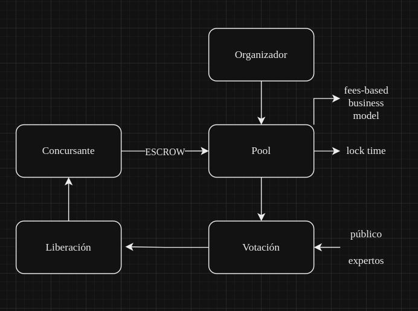

<b>zuyux</b> explota las capacidades de los contratos inteligentes para lograr la participación en concursos digitalizados de proyectos y la asignación transparente de fondos, fomentando la innovación y el crecimiento dentro de la comunidad de diseño digital. El proyecto será de código abierto bajo la licencia MIT, promoviendo la transparencia y la colaboración. Integrará la autenticación Worldcoin ID para validar perfiles, asegurando la confianza y la seguridad en todas las transacciones.

## Por qué es importante zuyux
<b>zuyux</b> es importante porque aborda la necesidad de una plataforma descentralizada específica para arquitectos y creadores digitales, facilitando un mercado seguro y eficiente. La creciente demanda de activos digitales y blockchain subraya su relevancia. El mercado global de gestión de activos digitales se valoró en 4.2 mil millones de USD en 2021 y se proyecta que alcanzará 8.5 mil millones de USD para 2026, con un crecimiento anual del 15.7% . Además, el 55% de los ejecutivos consideran la blockchain una prioridad estratégica . Estos datos indican un fuerte interés y adopción de tecnologías blockchain y activos digitales, lo que hace que <b>zuyux</b> sea una solución oportuna y valiosa.
